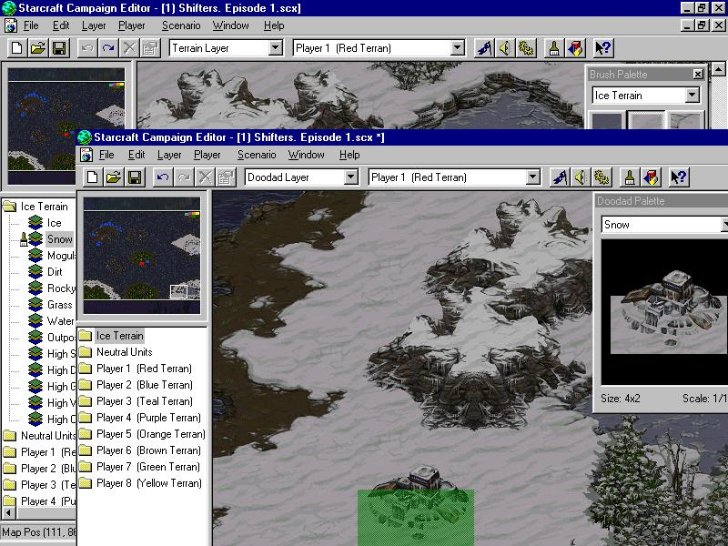

## Where I'm from

I've always known I wanted to have a career that centered around computers and technology. I'd say I got my first taste of "programming" in elementary school, even though I hadn't realized it. I was a big fan of the video game Starcraft, and probably logged hundreds of hours into that game growing up. But in the start menu of the game was the option to open the "Map Editor." Basically, this opened a blank file of the game engine that was used to make the game itself. From there, you could create your own maps, levels, and games using what they provided you. 

(If anyone is familiar with DotA 2 or League of Legends, you might know that the original DotA was created as a custom Warcraft map using the Warcraft map editor, which is a more advanced version of the Starcraft map editor. In fact, the first DotA was based off of a Starcraft custom map called Aeon of Strife)

The real "programming" in this engine came down to things called "Conditions" and "Triggers" which could be viewed as "If" and "Else" statements. For example, "If Player 1 has 10 resources at any point, he wins the game" or "If Player 2 walks a unit into this zone, destroy that unit" and so on. Since my Google-fu skills weren't up to par back then, I basically taught myself (with the help of a confounding manual) how to use the engine through brute force and "guess and check" type testing, where I kept trying to make it work until it worked. Granted, I was never able to create anything decent or anything anyone else would play, but learning how the game worked, and gaining insight into something that was formerly beyond my ken as a child was extremely satisfying.

When I first started college, my intentions were to learn programming to create video games, since I loved to play them, and I've always been somewhat tech savvy. However, as the years went by, I became less and less interested in that. But although my interests in gaming and the gaming industry in general sort of died down as I got older, my interest in technology and how this kind of world works remains. In my very first programming class in my first semester, I was told by my professor that learning computer science in general will change the way you look at the world, and I believe him. Every time I see a piece of machinery, I wonder how the programming and logic behind it could work. Whenever I see a door locked or unlocked, I think of it as a boolean operator.

## There and back again

Now, one of the things I'd like to learn the most, and one of the things I understand the least, is security. After reading some of Kevin Mitnick's writings, and seeing some of  the things that could be done in this field, I'm definitely leaning in this direction. My experience in ICS351 gave me a taste of what I wanted, with packet sniffing and being able to get into the gritty details of information being passed around, and I'm hoping I get to see more candid views of computers and software like that. They say you never stop learning, and I don't plan to.
